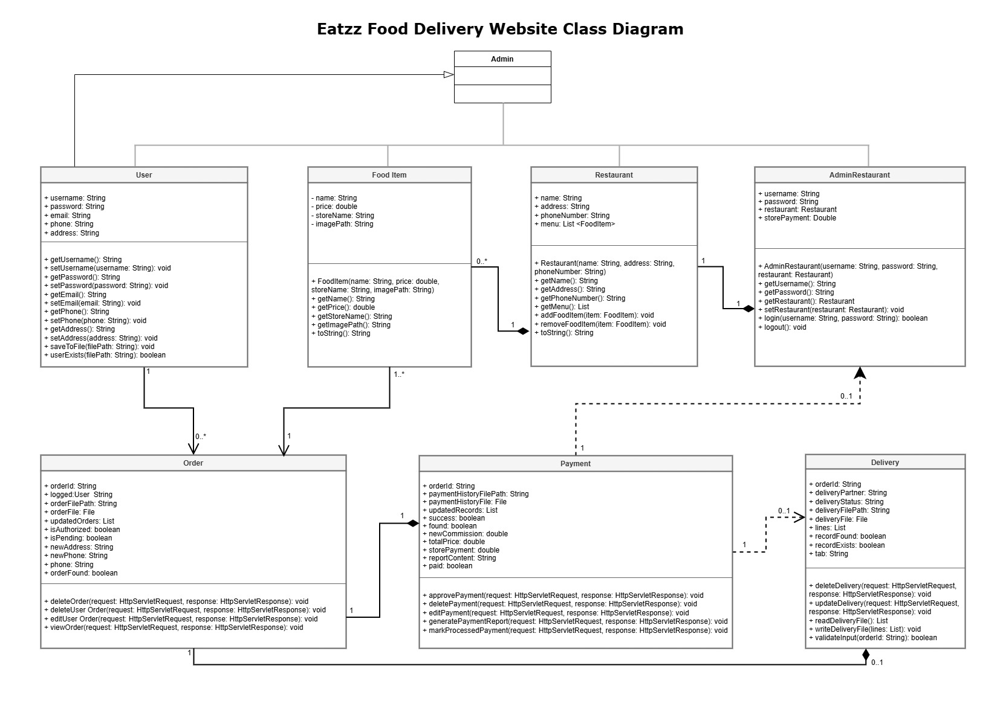

# Eatzz Food Delivery Website

## Navigation
- [Project Description](#project-description)
- [Class Diagram](#class-diagram)
- [Features](#features)
- [Classes Overview](#classes-overview)
- [Technology Stack](#technology-stack)
- [Installation](#installation)

## Project Description

The **Eatzz Food Delivery** website is a platform designed to facilitate online food ordering and delivery services. This project involves multiple user roles, including customers, restaurant administrators, and delivery personnel, interacting through a structured system that manages user accounts, food items, restaurants, orders, payments, and delivery tracking.

## Class Diagram



## Features

- **User  Registration:** Users can create accounts and manage their profiles.
- **Food Item Management:** Restaurants can add, update, and remove food items from their menus.
- **Restaurant Management:** Restaurants can edit their professional info and add, update, and remove food items from their menus.
- **Order Processing:** Users can place orders, which are stored in the system for management and tracking.
- **Payment Processing:** Secure payment options with transaction tracking.
- **Delivery Tracking:** Users can track their delivery's status in real-time.

## Classes Overview

- **User **
  - Manages user accounts and authentication.
  - Allows user profile updates.
  
- **Food Item**
  - Represents items available for ordering, including price and image paths.
  
- **Restaurant**
  - Holds data related to the restaurant's menu and contact information.
  
- **Order**
  - Represents individual orders, linking users with selected food items.
  
- **Payment**
  - Manages payment transactions related to orders.
  
- **Delivery**
  - Controls delivery statuses and related actions.

## Technology Stack

- **Frontend:** HTML, CSS, JavaScript
- **Backend:** Java Servlet, JSP
- **Database:** Text File
- **Server:** Apache Tomcat 9.0 or higher

## Installation

1. Clone the repository:
   ```bash
   git clone https://github.com/TharuPinsara/eatzz-food-delivery.git
